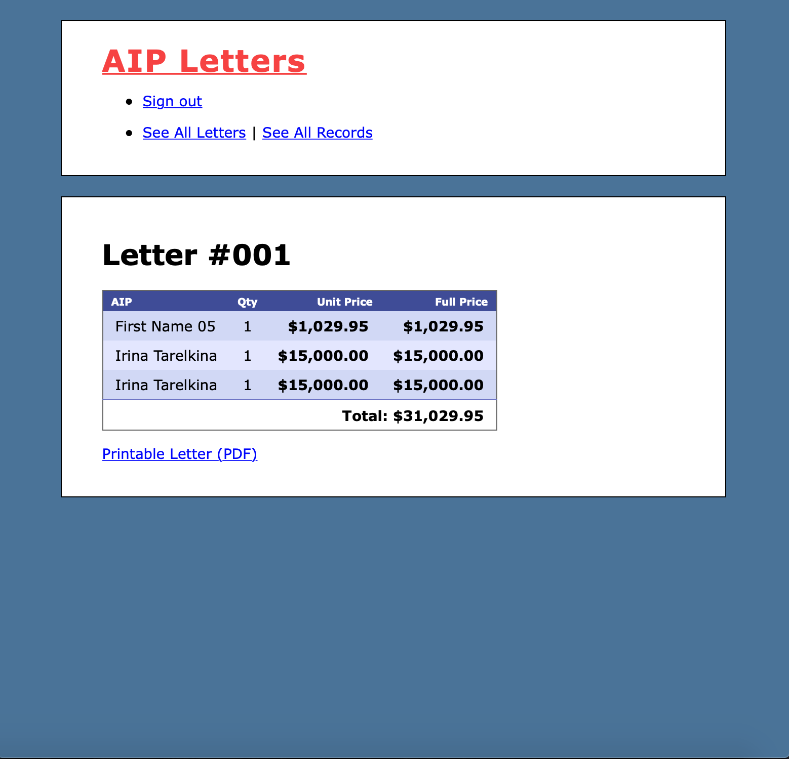

* Ruby version
ruby '2.5.3'

AIP is a project to automate the manual process to generate Annual Incentive Payment letters for employees in pdf using web application.
Core responsibilities were to build a new application to automate the letter generation process in PDF format, used TDD approach.
Tools / languages used: HTML5, CSS3, Ruby, Rails, Visual Studio Code, PostgreSQL, used TDD approach.

In my project I used the following API
gem 'prawn'
gem 'prawn-rails'
to generate letter in PDF by creating template.

Used the following API to import records for letter to CSV, to export records from CSV.
gem 'csv'
gem 'roo'
gem 'iconv'

Used gem 'devise' to set up users loging and security.
gem 'devise'

Deployed project in Heroku:
https://aip-irina-tarelkina.herokuapp.com

